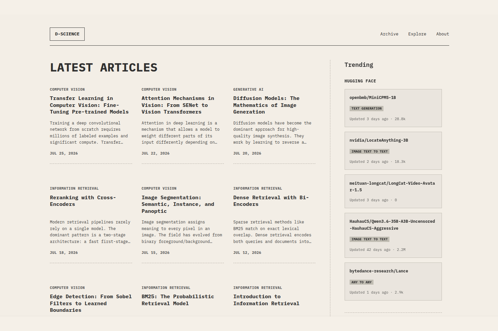

# D-Science — Hugo Theme

A vintage ledger-style theme for Hugo, built for data scientists, analysts, and researchers who want a clean, minimal blog without sacrificing functionality.



---

## Features

- **Vintage aesthetic** — IBM Plex Mono typography, parchment background, dashed borders
- **uPlot charts** — Lightweight chart shortcode using uPlot v1.6.32 (line and bar)
- **Trending sidebar** — Displays live HuggingFace trending models and Kaggle trending datasets (bundled data, auto-updated via workflow)
- **Archive page** — Filter articles by section with a dropdown
- **Explore page** — Visual stats: articles per month, top tags, articles per category
- **Giscus comments** — GitHub Discussions-based comment system
- **Google Analytics 4** — Optional GA4 integration
- **Google Search Console** — Optional site verification meta tag
- **Multilingual** — English and Indonesian (`i18n/en.toml`, `i18n/id.toml`)
- **Syntax highlighting** — Hugo built-in, no external dependency
- **Responsive** — Mobile, tablet, and desktop layouts
- **SEO ready** — Open Graph, Twitter Card, canonical URLs, robots.txt

---

## Requirements

- Hugo `v0.110.0` or later (Extended version required)

---

## Installation

### Option A — Git Submodule (recommended for most users)

```bash
# From your Hugo site root
git submodule add https://github.com/teranixbq/d-science.git themes/d-science
```

Then set the theme in your `hugo.toml`:

```toml
theme = "d-science"
```

To update the theme later:

```bash
git submodule update --remote --merge
```

### Option B — Hugo Module

Initialize your site as a Hugo module first:

```bash
hugo mod init github.com/yourusername/your-site
```

Then add to your `hugo.toml`:

```toml
[module]
  [[module.imports]]
    path = "github.com/teranixbq/d-science"
```

Run:

```bash
hugo mod get github.com/teranixbq/d-science
```

---

## Quick Start

Copy the example configuration from `exampleSite/hugo.toml` into your site's `hugo.toml`. The example site at `exampleSite/` contains working articles and configuration you can reference.

---

## Configuration Reference

### Basic Settings

```toml
baseURL = 'https://your-site.com/'
theme = 'd-science'
defaultContentLanguage = 'en'  # 'en' or 'id'
enableRobotsTXT = true
title = 'Your Site Title'

[pagination]
    pagerSize = 9  # Articles per page on homepage
```

### Site Parameters

```toml
[params]
    favicon = "/images/favicon.ico"  # Path to your favicon
    description = "Your site description for SEO"
    author = "Your Name"
    twitter = "@yourhandle"  # Optional, for Twitter Card meta tag
```

### Theme Appearance

Customize the color palette and font via CSS variables. All fields are optional — omit any field to use the default value.

```toml
[params.style]
    font_mono = "'IBM Plex Mono', 'Courier New', Courier, monospace"
    bg_primary = "#F5F0E8"       # Page background
    bg_body = "#EDE8DE"          # Body background
    text_primary = "#2C2C2C"     # Main text color
    text_muted = "#6B6560"       # Secondary text color
    border_primary = "#C8BFB5"   # Solid border color
    border_dashed = "#B0A99F"    # Dashed border color
    border_dark = "#2C2C2C"      # Dark border color
```

### Navigation Menu

```toml
[menu]
  [[menu.main]]
    identifier = "archive"
    name = "Archive"
    url = "/archive/"
    weight = 10
  [[menu.main]]
    identifier = "explore"
    name = "Explore"
    url = "/explore/"
    weight = 15
  [[menu.main]]
    identifier = "about"
    name = "About"
    url = "/about/"
    weight = 20
```

### Sidebar

```toml
[params.sidebar]
    enable_trending = true  # Show HuggingFace + Kaggle trending sidebar
```

When `enable_trending = true`, the sidebar displays the latest trending models from HuggingFace and trending datasets from Kaggle. The data is bundled with the theme and updated automatically in the theme repository every 5 days.

If you want to keep the data fresh in your own repository, see the [Live Trending Data](#live-trending-data) section below.

### Advertisements

```toml
[params.ads]
    enable_sidebar = false           # Show ad in sidebar
    sidebar_code = "<!-- Ad Code -->" # Your ad HTML code
    enable_in_article = false        # Show ad inside articles
    article_code = "<!-- Ad Code -->" # Your in-article ad HTML code
```

### Comments (Giscus)

D-Science uses [Giscus](https://giscus.app) for comments, powered by GitHub Discussions.

**Setup steps:**
1. Go to [giscus.app](https://giscus.app)
2. Enter your repository name
3. Enable GitHub Discussions on your repo (Settings → Features → Discussions)
4. Copy the generated `repoId` and `categoryId`

```toml
[params.giscus]
    enable = false                   # Set to true to enable comments
    repo = "username/repository"     # Your GitHub repo (e.g. "teranixbq/my-site")
    repoId = "YOUR_REPO_ID"          # From giscus.app
    category = "General"             # Discussion category name
    categoryId = "YOUR_CATEGORY_ID"  # From giscus.app
    mapping = "url"                  # How to map pages to discussions
    strict = "0"
    reactionsEnabled = "1"
    emitMetadata = "0"
    inputPosition = "top"            # "top" or "bottom"
    theme = "light_protanopia"       # Giscus theme
    lang = "en"                      # Comment interface language
    loading = "lazy"

# To disable comments on a specific page, add to its frontmatter:
# enablecomment: false
```

### Google Search Console

Verify your site ownership with Google Search Console.

**How to get the verification code:**
1. Go to [Google Search Console](https://search.google.com/search-console)
2. Add your property → Select "URL prefix"
3. Choose "HTML tag" verification method
4. Copy only the `content` value from the meta tag (e.g. `abc123xyz`)

```toml
[params.google]
    search_console_verification = "abc123xyz"  # Paste your verification code here
```

### Google Analytics 4

Track site traffic with Google Analytics 4.

**How to get your Measurement ID:**
1. Go to [Google Analytics](https://analytics.google.com)
2. Admin → Data Streams → Your web stream
3. Copy the Measurement ID (format: `G-XXXXXXXXXX`)

```toml
[params.google]
    analytics_id = "G-XXXXXXXXXX"  # Your GA4 Measurement ID
```

---

## Content Structure

### Creating Sections

D-Science is organized around content sections (e.g. `image-processing`, `machine-learning`). Each section becomes a filterable category in Archive and Explore pages.

```
content/
├── image-processing/
│   ├── _index.md          # Section index page
│   └── my-article.md
├── machine-learning/
│   ├── _index.md
│   └── another-article.md
├── about.md               # About page
├── archive.md             # Archive page (required)
└── explore.md             # Explore page (required)
```

### Article Frontmatter

```yaml
---
title: "Your Article Title"
date: 2025-01-15
description: "Brief description for SEO and article cards"
author: "Your Name"
tags: ["machine-learning", "python", "deep-learning"]
categories: ["tutorial"]
image: "/images/your-image.jpg"  # Optional: OG image
enablecomment: true              # Optional: override comment setting
---
```

### Required Pages

The theme requires three special pages with `build.list: never` to exclude them from article listings:

**`content/archive.md`:**
```yaml
---
title: "Archive"
layout: "single"
build:
  list: never
---
```

**`content/explore.md`:**
```yaml
---
title: "Explore"
layout: "single"
build:
  list: never
---
```

**`content/about.md`:**
```yaml
---
title: "About"
build:
  list: never
---
Your about page content here.
```

---

## Chart Shortcode

D-Science includes a built-in chart shortcode powered by [uPlot](https://github.com/leeoniya/uPlot).

### Line Chart

```markdown

{
  "labels": ["Epoch 1", "Epoch 2", "Epoch 3", "Epoch 4", "Epoch 5"],
  "datasets": [{
    "label": "Validation Accuracy",
    "data": [0.72, 0.81, 0.86, 0.89, 0.91]
  }]
}

```

### Bar Chart

```markdown

{
  "labels": ["Images", "Text", "Audio", "Video"],
  "datasets": [{
    "label": "Size (GB)",
    "data": [120, 45, 30, 200]
  }]
}

```

### Chart Parameters

| Parameter | Default | Description |
|-----------|---------|-------------|
| `title` | _(none)_ | Chart title displayed above the chart |
| `type` | `line` | Chart type: `line` or `bar` |
| `id` | auto-generated | Custom HTML element ID |

---

## Live Trending Data

The sidebar trending data is bundled with the theme (`data/huggingface.json` and `data/kaggle.json`) and updated every 5 days in the theme repository. When you install the theme, you get the latest data from the most recent release.

If you want to keep the data continuously fresh in your own repository, follow these steps:

### Step 1 — Copy the scripts

Copy the scripts directory from `exampleSite/scripts/` to your site root:

```bash
cp -r themes/d-science/exampleSite/scripts ./scripts
```

### Step 2 — Copy the workflow

Copy the workflow file from `themes/d-science/.github/workflows/fetch-trending.yml` to your site root:

```bash
mkdir -p .github/workflows
cp themes/d-science/.github/workflows/fetch-trending.yml .github/workflows/
```

### Step 3 — Copy the data directory

```bash
cp -r themes/d-science/data ./data
```

### Step 4 — Push to GitHub

```bash
git add scripts/ .github/ data/
git commit -m "chore: add trending data workflow"
git push
```

The workflow will now run every 5 days at 05:00 UTC and update `data/kaggle.json` and `data/huggingface.json` in your repository automatically. You can also trigger it manually from the GitHub Actions tab.

> **Note:** Kaggle data is sourced from the [KaggleTrending](https://github.com/teranixbq/KaggleTrending) repository, which maintains a daily CSV archive of trending datasets.

---

## Taxonomies

```toml
[taxonomies]
    tag = "tags"
    category = "categories"
```

Tag pages are available at `/tags/` and category pages at `/categories/`. Tags are displayed on article pages and link to their respective taxonomy pages.

> **Note:** Tags should use `kebab-case` format (e.g. `"deep-learning"`, `"computer-vision"`) to ensure correct URL generation.

---

## Markup Configuration

```toml
[markup]
    [markup.goldmark]
        [markup.goldmark.renderer]
            unsafe = true   # Required to allow raw HTML in Markdown content
    [markup.highlight]
        noClasses = false   # Required for syntax highlighting CSS classes
```

`unsafe = true` is required if your articles contain raw HTML. `noClasses = false` is required for the built-in syntax highlighting to work correctly.

---

## Multilingual Support

D-Science ships with English (`en`) and Indonesian (`id`) translations. Set your language in `hugo.toml`:

```toml
defaultContentLanguage = 'en'  # or 'id'
```

The `i18n/` directory contains all translatable strings. To add a new language, create `i18n/[lang-code].toml` following the structure of `i18n/en.toml`.

---

## License

[MIT License](LICENSE) — Copyright (c) 2025 Teranix
